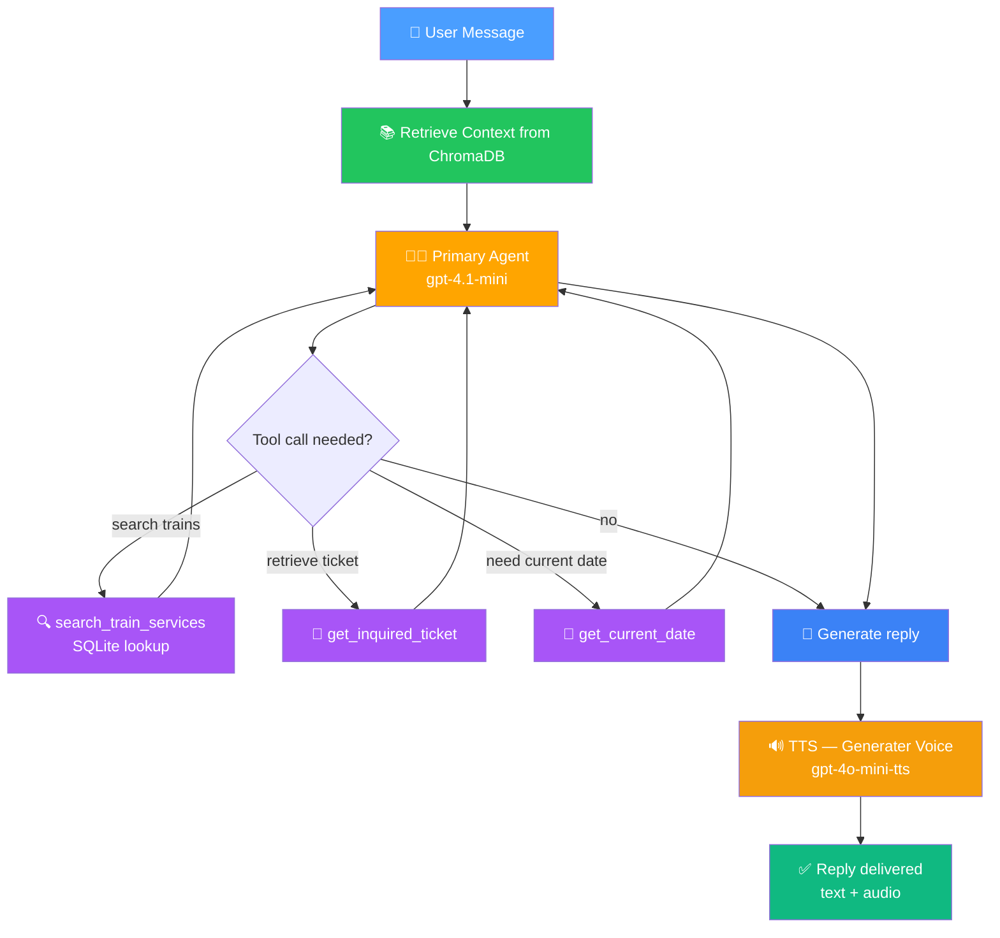

# ☘️ AI-Powered Train Assistant for Ireland 🚆

A conversational AI assistant for Irish rail passengers — ask about timetables, fares, stations, accessibility, bikes, and more in plain English and get spoken answers back.

🚀 **Live demo:** [Hugging Face Space](https://huggingface.co/spaces/yasinemirkutlu44/<your-space-name>)

Plan your journey → the assistant searches scheduled services, looks up policies in its knowledge base, and responds aloud in a natural voice.

---

## ✨ What It Does

Ask the assistant anything about travelling by train in Ireland. It can:

1. **Search train services** — find scheduled trains between stations with departure time, arrival time, duration, and indicative fare.
2. **Recall the last ticket** — return the ticket you just asked about (by option number or ticket ID) for booking.
3. **Answer policy questions** — bikes, accessibility, stations, routes, and operational policies are grounded in a RAG knowledge base.
4. **Know the current date** — understands "tomorrow", "next Thursday", and similar fuzzy dates by calling a date tool.
5. **Speak its replies** — every answer is converted to natural speech using GPT-4o-mini-TTS.

---

## 📸 Screenshots

*(Add screenshots of the chat interface, an example journey query, and the audio playback here.)*

---

## 🧠 How It Works

The assistant combines three patterns: **tool calling** for structured data lookups, **RAG** for unstructured policy knowledge, and **text-to-speech** for accessibility.

| Component | Role | Output |
|-----------|------|--------|
| 🧑‍💼 **Primary Agent** | Answers user questions in plain English. Invokes tools when needed and grounds answers in retrieved context. | `gpt-4.1-mini` |
| 🔍 **`search_train_services` Tool** | Queries a SQLite DB of Irish rail services for trains matching station, date, and time filters. Station names are fuzzy-matched (e.g., "dublin" → "Dublin Heuston"). | List of ticket options with fares |
| 🎫 **`get_inquired_ticket` Tool** | Returns the full details of a previously shown ticket for booking. | Ticket JSON |
| 📅 **`get_current_date` Tool** | Provides the current date/time so the model can resolve fuzzy dates like "tomorrow" or "next Thursday". | Formatted date string |
| 📚 **Knowledge Base (RAG)** | Markdown documents about stations, routes, policies, and helpers, embedded with OpenAI `text-embedding-3-large` and stored in ChromaDB. Retrieved context is injected into the system prompt for every turn. | Relevant document chunks |
| 🔊 **TTS Engine** | Converts each assistant reply into natural Irish-accented speech via `gpt-4o-mini-tts`. | Audio file auto-played in the UI |

---

## 🔄 How It Works (Diagram)



---

## 💻 Running Locally

**1. Clone the repo**

```bash
git clone https://github.com/yasinemirkutlu44/AI-Powered-Train-Assistant-for-Ireland.git
cd AI-Powered-Train-Assistant-for-Ireland
```

**2. Install dependencies**

```bash
pip install -r requirements.txt
```

**3. Set your OpenAI API key**

Create a `.env` file in the project root:

```
OPENAI_API_KEY=sk-...
```

**4. Verify supporting files are present**

Make sure these are in the project root:
- `irish_rail_services_2026_sample.csv` — train services data
- `knowledge_base/` — folder containing markdown files organised into subfolders (`helpers/`, `policies/`, `routes/`, `stations/`)

On first run, the app will automatically:
- Build a SQLite database from the CSV
- Embed the knowledge base and create a ChromaDB vector store

**5. Launch the app**

```bash
python app.py
```

The Gradio UI opens in your browser.

---

## 🎯 Design Highlights

- **Hybrid retrieval** — structured queries (trains, tickets, dates) go to SQL and deterministic tools; unstructured queries (policies, accessibility, station info) go to a vector store. Each type of information lives where it's best retrieved.
- **Fuzzy station matching** — users don't need to know official station names. "Dublin to Cork" resolves to "Dublin Heuston → Cork (Kent)" via alias tables and `difflib` fallback.
- **Ticket caching** — the most recent search results are cached so the user can say "book option 2" and the assistant knows exactly which ticket that refers to.
- **Accessibility-first** — every reply is spoken aloud in a natural voice, supporting visually impaired users and making the interaction feel conversational.
- **Grounded responses** — the RAG layer ensures the assistant answers based on actual Irish Rail documentation rather than hallucinating policies.

---

## 🛠️ Possible Extensions

- Live timetable integration via Irish Rail's real-time API
- Multi-turn booking flow (select ticket → enter passenger details → confirm)
- Multilingual support (Irish Gaelic, Polish, etc.)
- Accessibility filters ("wheelchair-accessible services only")
- Push notifications for service disruptions via Pushover or email

---

## 📜 License

MIT — feel free to fork, adapt, and build on top of this.

---

🧠 **Built with OpenAI frontier models, LangChain, ChromaDB, and Gradio** 🚀

